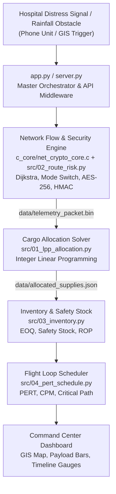

<div align="center">

# Project ASAP
### Automated Supply & Air-relief Platform

**From distress signal to secured, optimized, scheduled drone relief mission in seconds.**

*An integrated Operations Research + Cybersecurity decision engine for hospitals cut off by disaster.*

[](https://16701asap.streamlit.app/)


**[Try the Live Command Center](https://16701asap.streamlit.app/)** &nbsp;|&nbsp;
[GitHub](https://github.com/SRReumah/ASAP) &nbsp;|&nbsp;
[Quick Start](#quick-start) &nbsp;|&nbsp;
[Architecture](#system-architecture) &nbsp;|&nbsp;
[Methodology](#mathematical-methodology) &nbsp;|&nbsp;
[Team](#the-team)

</div>

---

## Table of Contents

1. [The Pitch in 30 Seconds](#the-pitch-in-30-seconds)
2. [The Problem](#the-problem)
3. [Our Solution](#our-solution)
4. [Who It Is For](#who-it-is-for)
5. [Key Features](#key-features)
6. [Demo Walkthrough](#demo-walkthrough)
7. [System Architecture](#system-architecture)
8. [Tech Stack](#tech-stack)
9. [Quick Start](#quick-start)
10. [Mathematical Methodology](#mathematical-methodology)
11. [Security Model](#security-model)
12. [Repository Structure](#repository-structure)
13. [Engineering Decisions](#engineering-decisions)
14. [Known Limitations](#known-limitations)
15. [Roadmap](#roadmap)
16. [The Team](#the-team)
17. [Contributing](#contributing)
18. [Disclaimer and License](#disclaimer-and-license)

---

## The Pitch in 30 Seconds

> A flooded city. Roads underwater. A hospital ICU running on a diesel generator with hours of fuel left.
>
> Today, getting it help means phone calls, spreadsheets, and guesswork under pressure.
>
> **Project ASAP replaces that with one button.** A hospital sends a distress signal, and ASAP decides *how* to reach it, *what* to send, *when* to resupply, and *how long* it will take. It then encrypts the mission and shows everything on a live map.

| | Manual Coordination | Project ASAP |
|---|---|---|
| Route decision | Radio calls, local knowledge | Dijkstra shortest path with automatic air/ground switching |
| Cargo choice | Best guess | Integer Linear Programming, provably optimal for the scenario |
| Resupply timing | Reactive, after shortage | Predictive reorder alert before generator failure |
| Mission timing | Rough estimate | PERT/CPM with critical path and variance |
| Data integrity | Unsecured messages | AES-256 encryption + HMAC-SHA256 tamper detection |
| Time to decision | Minutes to hours | Seconds |

---

## The Problem

When severe flooding or natural disasters strike:

- **Roads submerge**, cutting hospitals off from ground logistics.
- **Power grids fail**, forcing ICUs and life support onto backup diesel generators that burn through fuel quickly.
- **Communications degrade**, and the messages that do get through can be spoofed or corrupted.
- **Coordinators decide under pressure**, often manually and with incomplete information, which leads to wrong cargo, late resupply, and wasted flights.

Every one of these is a well-studied problem in Operations Research. What is missing is a system that solves them **together, automatically, and securely**.

---

## Our Solution

Project ASAP is an automated emergency-response "brain". A single distress broadcast triggers a four-stage decision pipeline:

| Question | Engine | Answer (Reference Scenario) |
|---|---|---|
| **How** do we get there safely? | Network Flow, Risk & Security (C / Python) | Roads blocked, so switch to air drones; 12 km shortest path; AES-256 encrypted telemetry |
| **What** do we send? | Cargo Optimizer (Integer LPP) | Optimal mix of fuel, medical kits and food within strict weight caps (300 kg air / 3000 kg ground) |
| **When** do we resupply? | Inventory Control (EOQ) | Reorder alert at 65 L, protected by a 35 L safety buffer |
| **How long** will it take? | Flight Scheduler (PERT/CPM) | 76.33 min round-trip mission loop with critical bottleneck path identified |

Every result is computed live by backend engines, written to disk as physical artifacts (`.json`, `.bin`), and visualized in an interactive **GIS Command Center** with bilingual station labels (English and Malayalam).

---

## Who It Is For

| Persona | Pain Today | What ASAP Gives Them |
|---|---|---|
| **Disaster response coordinator** (district / state emergency ops) | Juggling many hospitals, routes and vehicles at once | One dashboard with ranked, optimized missions |
| **Hospital administrator** | No visibility into when help arrives or what is coming | A distress button plus predictable resupply alerts |
| **Drone / logistics operator** | Unclear payloads and unsafe routes | Weight-capped cargo plans and a timed flight schedule |
| **Security / IT officer** | Mission data sent in the clear | Encrypted, integrity-checked telemetry packets |
| **Students and researchers** | OR techniques taught in isolation | A working reference showing ILP, EOQ, PERT/CPM and Dijkstra chained together |

---

## Key Features

- **Intelligent Mode Switching and GIS Mapping**
  Detects flooded road segments using staggered rainfall thresholds and automatically reroutes from ground trucks to air relief drones on Carto-Voyager GIS maps.

- **Tamper-Resistant Telemetry**
  Encrypts mission parameters with AES-256-CBC and signs them with an HMAC-SHA256 integrity tag inside a 109-byte packed binary struct.

- **Multi-Scenario Cargo Optimization**
  Solves Integer Linear Programming cargo packing for three disaster profiles: **Power Grid Blackout**, **Mass Trauma Surge**, and **Balanced Relief**.

- **Predictive Fuel Reserves**
  Uses Economic Order Quantity and statistical safety-stock models to raise reorder alerts *before* a generator runs dry.

- **Mission Timeline Forecasting**
  PERT/CPM engine computes expected task durations, variance, slack, and the critical path (A, D, E, F).

- **Triple-Layer Fault Tolerance**
  Runs on Streamlit Cloud, locally, or on a zero-dependency HTML/JS fallback server, so the dashboard stays available even if one layer fails.

---

## Demo Walkthrough

Try this on the [live app](https://16701asap.streamlit.app/) in under two minutes:

1. **Trigger the emergency.** Send a distress signal from a hospital station (phone unit view) or raise rainfall on the GIS map.
2. **Watch the route change.** Flooded road edges drop out of the network and the mode switches from Ground to Air.
3. **Pick a scenario.** Switch between Power Grid Blackout, Mass Trauma Surge and Balanced Relief, and watch the payload bars rebalance.
4. **Check the reserves.** See the fuel level against the 65 L reorder point and 35 L safety buffer.
5. **Read the timeline.** Review the PERT chart, the critical path, and the 76.33 minute mission loop.
6. **Inspect the proof.** Open `data/allocated_supplies.json` and `data/telemetry_packet.bin` to see the artifacts each engine produced.

> **Screenshots:** add images to `docs/images/` and reference them here, for example:
> ``

---

## System Architecture

Four independent engines run in sequence under a central orchestrator. Each engine writes a physical artifact that the next stage and the dashboard consume.



### Pipeline Contract

| Stage | Input | Output Artifact | Consumed By |
|---|---|---|---|
| 1. Network Flow & Security | `data/city_nodes.csv`, rainfall / flood state | `data/telemetry_packet.bin` (109 bytes) | Cargo solver, dashboard |
| 2. Cargo Allocation (ILP) | Transport mode, payload cap, scenario weights | `data/allocated_supplies.json` | Inventory engine, dashboard |
| 3. Inventory Control | Fuel burn rate, lead time, delivered fuel | Reorder status, safety stock | Scheduler, dashboard |
| 4. PERT/CPM Scheduler | Task time estimates (a, m, b) | Critical path, mission duration | Dashboard |

---

## Tech Stack

| Layer | Technology |
|---|---|
| Routing & Security Core | C (GCC), Dijkstra's Algorithm, AES-256-CBC, HMAC-SHA256 |
| Optimization & Analytics | Python 3.8+ (bounded integer ILP solver, EOQ, PERT/CPM) |
| GIS & Dashboards | Streamlit, Plotly (Carto-Voyager tiles), Pandas, Leaflet.js |
| API Middleware | Python HTTP server (`server.py`, `app.py`) |
| Data Artifacts | CSV, JSON, packed binary (`.bin`) |
| Deployment | Streamlit Community Cloud, local, static HTML fallback |

---

## Quick Start

### Prerequisites

- Python 3.8 or newer
- GCC (optional; a pre-compiled Windows executable is included in `c_core/`)

### 1. Clone the repository

```bash
git clone https://github.com/SRReumah/ASAP.git
cd ASAP
```

### 2. Install dependencies

```bash
pip install -r requirements.txt
```

### 3. Launch the Command Center

```bash
streamlit run app.py
```

Open `http://localhost:8501` in your browser.

### Alternative Run Modes

<details>
<summary><b>Option B: Offline native server (no Streamlit needed)</b></summary>

```bash
python server.py
```

Opens `index.html` at `http://localhost:8000` automatically.
</details>

<details>
<summary><b>Option C: Run each engine on its own</b></summary>

```powershell
# Network Flow & Security Engine (C, Windows binary)
.\c_core\net_crypto_core.exe 1 0

# Route Risk Assessment Engine
python src/02_route_risk.py

# Multi-Scenario Cargo Allocation Solver
python src/01_lpp_allocation.py

# Inventory & Safety Stock Control
python src/03_inventory.py

# PERT/CPM Flight Loop Scheduler
python src/04_pert_schedule.py
```
</details>

<details>
<summary><b>Building the C core on Linux or macOS</b></summary>

```bash
gcc c_core/net_crypto_core.c -o c_core/net_crypto_core
./c_core/net_crypto_core 1 0
```

If the core links against an external crypto library (for example OpenSSL), add the matching flag such as `-lcrypto`.
</details>

---

## Mathematical Methodology

<details open>
<summary><b>1. Network Routing (Dijkstra)</b></summary>

For each edge $(u, v)$ with weight $w(u,v)$, distance is relaxed when:

$$d(v) > d(u) + w(u, v) \;\Rightarrow\; d(v) \leftarrow d(u) + w(u, v)$$

Edges whose flood level exceeds their threshold are removed from the ground network. If no ground path remains, the system switches to air relief mode.
</details>

<details open>
<summary><b>2. Cargo Optimization (Integer Linear Programming)</b></summary>

**Objective:** maximize priority-weighted relief value across stations $h \in H$ with urgency score $U_h$:

$$\max Z = \sum_{h \in H} U_h \left( w_{\text{fuel}} \, x_h^{\text{fuel}} + w_{\text{med}} \, x_h^{\text{med}} + w_{\text{food}} \, x_h^{\text{food}} \right)$$

**Subject to the payload ceiling:**

$$0.85\,x_h^{\text{fuel}} + 12.0\,x_h^{\text{med}} + 25.0\,x_h^{\text{food}} \le \text{CAP}_{\text{payload}} \quad (300\text{ kg Air} \;/\; 3000\text{ kg Ground})$$

$$x_h^{\text{fuel}},\; x_h^{\text{med}},\; x_h^{\text{food}} \in \mathbb{Z}_{\ge 0}$$

| Commodity | Unit | Unit Weight | Scenario Weight (Power / Medical / Balanced) |
|---|---|---|---|
| Generator Fuel | Litre | 0.85 kg | 5.0 / 1.0 / 3.0 |
| Medical Kit | Kit | 12.0 kg | 1.0 / 5.0 / 2.5 |
| Food Crate | Crate | 25.0 kg | 1.0 / 1.0 / 1.2 |
</details>

<details open>
<summary><b>3. Inventory Control & Safety Stock</b></summary>

| Metric | Formula | Reference Value |
|---|---|---|
| Economic Order Quantity | $\text{EOQ} = \sqrt{\dfrac{2DS}{H}}$ | Dynamic |
| Safety Stock | $\text{SS} = Z \cdot \sigma_d \cdot \sqrt{L} = 1.65 \times 12.0 \times \sqrt{3}$ | $\approx 34.3 \rightarrow$ **35 L** |
| Reorder Point | $\text{ROP} = \bar{d} \cdot L + \text{SS}$ | **65 L** |

$Z = 1.65$ corresponds to roughly a 95% service level. With a 3-day lead time, the 65 L reorder point implies an average burn of 10 L/day (30 L lead-time demand plus 35 L safety stock).
</details>

<details open>
<summary><b>4. PERT/CPM Flight Scheduling</b></summary>

| Metric | Formula | Meaning |
|---|---|---|
| Expected Task Time | $T_e = \dfrac{a + 4m + b}{6}$ | Weighted average of optimistic, most likely and pessimistic times |
| Task Variance | $\sigma^2 = \left(\dfrac{b - a}{6}\right)^2$ | Uncertainty spread |
| Slack | $\text{Slack} = \text{LS} - \text{ES}$ | Zero slack means the task is on the critical path |

The zero-slack sequence **A, D, E, F** forms the critical path, giving a non-delayable mission round trip of **76.33 minutes**.
</details>

---

## Security Model

| Property | Mechanism | What It Protects Against |
|---|---|---|
| Confidentiality | AES-256-CBC | Interception of mission parameters (destination, cargo, timing) |
| Integrity & authenticity | HMAC-SHA256 tag | Tampered or spoofed telemetry packets |
| Compact transport | 109-byte packed binary struct | Bandwidth limits on degraded links |

**Prototype scope:** keys are handled for demonstration purposes. A production deployment would need proper key management (secure storage, rotation, per-device keys), a fresh random IV per packet, encrypt-then-MAC verification before decryption, and replay protection (timestamps or nonces).

---

## Repository Structure

```text
ASAP/
├── app.py                      # Master Streamlit GIS Command Center
├── server.py                   # Python HTTP API server & middleware
├── index.html                  # Dual-view web command center (phone / laptop UI)
├── requirements.txt            # Python dependencies
├── c_core/
│   ├── net_crypto_core.c       # Routing, mode switch & AES-256/HMAC engine
│   └── net_crypto_core.exe     # Pre-compiled Windows binary
├── data/
│   ├── city_nodes.csv          # Station nodes: coordinates, demand, flood limits
│   ├── allocated_supplies.json # Output of the ILP cargo solver
│   └── telemetry_packet.bin    # Output of the C security engine (109 bytes)
└── src/
    ├── 01_lpp_allocation.py    # Multi-scenario ILP cargo allocation
    ├── 02_route_risk.py        # GIS route risk & telemetry assessment
    ├── 03_inventory.py         # Inventory control & EOQ
    └── 04_pert_schedule.py     # PERT/CPM flight loop scheduler
```

---

## Engineering Decisions

| Decision | Why |
|---|---|
| **C for routing and crypto** | Fast, low-level control over the packed binary struct; mirrors how embedded drone firmware would handle telemetry. |
| **Python for optimization** | Clear, readable OR models that are easy to verify against textbook formulas. |
| **File artifacts between stages** | Each engine can be run, tested and debugged on its own; outputs are inspectable evidence. |
| **Three run modes** | A disaster tool must not depend on a single server; the HTML fallback works with no installs. |
| **Bilingual labels** | Local responders read station names in their own language (Malayalam alongside English). |

---

## Known Limitations

We would rather be clear about these than overclaim:

- **Simulated data.** Station locations, demands and flood thresholds are synthetic.
- **Single-vehicle model.** The ILP plans one payload per mission; fleet-level routing (VRP) is not yet modelled.
- **Static weights.** Scenario weights are hand-set rather than learned from real incident data.
- **No aviation compliance.** Drone flight rules, airspace permissions and weather limits are out of scope.
- **Prototype cryptography.** See [Security Model](#security-model) for what production would require.
- **Windows-first binary.** The bundled C executable targets Windows; other platforms must compile from source.

---

## Roadmap

| Phase | Goal | Highlights |
|---|---|---|
| **v1.0 (current)** | Academic prototype | Four engines, live dashboard, encrypted telemetry |
| **v1.5** | Fleet scale | Multi-drone Vehicle Routing Problem, multiple hospitals per mission |
| **v2.0** | Real data | Live rainfall / flood feeds, real road networks via OpenStreetMap |
| **v2.5** | Field readiness | Key management, replay protection, offline mobile app for hospitals |
| **v3.0** | Pilot | Partnership with a disaster management authority or NGO for a tabletop exercise |

---

## The Team

Project ASAP was built by a team of four, each owning one engine end to end.

| Member | Module | Ownership |
|---|---|---|
| **[Member 1 Name]** ([@github-handle](https://github.com/)) | Module 1: LPP Cargo Allocation | Linear programming, multi-commodity payload optimization, scenario weights |
| **[Member 2 Name]** ([@github-handle](https://github.com/)) | Module 2: Network Flow & Security | Dijkstra shortest path, flood risk thresholds, AES-256/HMAC cryptography |
| **[Member 3 Name]** ([@github-handle](https://github.com/)) | Module 3: Inventory Control | Fuel burn modelling, EOQ, safety reserve alarms |
| **[Member 4 Name]** ([@github-handle](https://github.com/)) | Module 4: PERT/CPM Flight Scheduler | Task variance, forward/backward passes, critical path analysis |

**Shared work:** system integration, the Streamlit Command Center, the HTML fallback server, and deployment.

---

## Contributing

Ideas, issues and pull requests are welcome.

1. Fork the repository.
2. Create a branch: `git checkout -b feature/your-idea`
3. Commit your changes with a clear message.
4. Open a pull request describing what changed and why.

Good first contributions: real-world datasets, unit tests for each engine, a Linux/macOS build script, and screenshots for this README.

---

## Disclaimer and License

Project ASAP is an **academic prototype** that demonstrates how Operations Research, GIS modelling and cybersecurity can work together. It uses simulated disaster data and has not been evaluated for civil aviation compliance or production-grade cryptographic deployment. Do not use it for real emergency operations.

Distributed under the **MIT License**. See `LICENSE` for details.

<div align="center">

**Built to deliver relief where it is needed most, ASAP.**

[Try the Live Demo](https://16701asap.streamlit.app/) &nbsp;|&nbsp; Star the repo if you found it useful

</div>