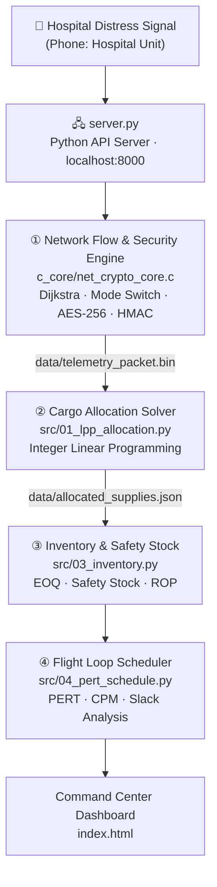

<div align="center">

# ⚡ Project ASAP
### Automated Supply & Air-relief Platform

**An integrated Operations Research + Cybersecurity pipeline that turns a hospital's distress signal into a secured, optimized, scheduled drone relief mission in seconds.**


[Overview](#-overview) •
[Features](#-key-features) •
[Architecture](#-system-architecture) •
[Quick Start](#-quick-start) •
[Methodology](#-mathematical-methodology) •
[Team](#-team)

</div>

---

## 📖 Overview

### The Problem
When a severe flood hits a city, roads go underwater, power fails, and communications degrade. Hospitals running ICUs and life-support on backup generators can run out of diesel within hours, and ground vehicles cannot reach them. Today, relief coordination in these moments is largely manual: someone has to decide **what** to send, **how** to send it, **when** to resupply, and **how long** it will take, all under extreme time pressure.

### The Solution
**Project ASAP** is an automated emergency-response "brain". A single distress broadcast from a hospital triggers a four-stage decision pipeline that:

| Question | Engine | Answer (reference scenario) |
|---|---|---|
| **How** do we get there safely? | Network Flow & Security (C) | Roads blocked → switch to air; 12 km shortest path; AES-256 encrypted telemetry |
| **What** do we send? | Cargo Optimizer (ILP) | Optimal mix of fuel, medical kits and food within a 300 kg payload |
| **When** do we resupply? | Inventory Control (EOQ) | Reorder alert at 65 L, protected by a 35 L safety buffer |
| **How long** will it take? | Flight Scheduler (PERT/CPM) | Round-trip mission loop of 76.33 minutes, bottleneck identified |

Every result is computed live by real backend engines, written to disk as artifacts, and visualized in an interactive **Command Center Dashboard**.

---

## ✨ Key Features

- **Intelligent mode switching** – detects flooded road segments and automatically reroutes from ground transport to air-relief drones.
- **Tamper-resistant telemetry** – drone command packets are encrypted with AES-256-CBC and signed with an HMAC-SHA256 integrity tag, packed into a fixed 109-byte binary struct.
- **Optimal cargo packing** – Integer Linear Programming maximizes priority-weighted relief value under strict payload limits.
- **⛽ Predictive fuel alarms** – EOQ and statistical safety-stock models trigger reorders before a hospital reaches a critical level.
- **⏱️ Mission timeline forecasting** – PERT/CPM computes expected durations, variance, slack and the critical path of every flight loop.
- **🖥️ Live command dashboard** – dual-view UI (Hospital phone unit / Command Center laptop) backed by a Python API server that executes the real engines on demand.
- **Modular by design** – each engine runs standalone for testing and review, or chained together as a full pipeline.

---

## System Architecture

The platform consists of four independent backend engines executed sequentially by a central API server. Each engine produces a physical data artifact consumed by the dashboard.



<details>
<summary><b>Plain-text architecture diagram</b> (for viewers without Mermaid support)</summary>

```text
                ┌──────────────────────────────────────────┐
                │     Hospital Distress Signal Broadcast   │
                └────────────────────┬─────────────────────┘
                                     │
                                     ▼
┌──────────────────────────────────────────────────────────────────────────┐
│ ① Network Flow & Security Engine          c_core/net_crypto_core.c       │
│   • Dijkstra shortest path (12 km)  • Air vs. ground mode switching      │
│   • AES-256-CBC payload encryption  • HMAC-SHA256 integrity tag          │
│   └─► data/telemetry_packet.bin  (109-byte packed binary struct)         │
└────────────────────────────────────┬─────────────────────────────────────┘
                                     ▼
┌──────────────────────────────────────────────────────────────────────────┐
│ ② Cargo Allocation Solver (ILP)           src/01_lpp_allocation.py       │
│   • Priority-weighted relief value maximization                          │
│   • 300 kg air payload constraint across multi-commodity demand          │
│   └─► data/allocated_supplies.json                                       │
└────────────────────────────────────┬─────────────────────────────────────┘
                                     ▼
┌──────────────────────────────────────────────────────────────────────────┐
│ ③ Inventory & Safety Stock Control        src/03_inventory.py            │
│   • Economic Order Quantity and daily fuel burn                          │
│   • Safety stock 35 L  •  Reorder point 65 L                             │
└────────────────────────────────────┬─────────────────────────────────────┘
                                     ▼
┌──────────────────────────────────────────────────────────────────────────┐
│ ④ PERT/CPM Flight Loop Scheduler          src/04_pert_schedule.py        │
│   • Expected durations and variance  • Forward/backward pass slack       │
│   • Critical path A → D → E → F  =  76.33 minutes                        │
└──────────────────────────────────────────────────────────────────────────┘
```

</details>

### Tech Stack

| Layer | Technology |
|---|---|
| Routing & security core | C (GCC), Dijkstra's algorithm, AES-256-CBC, HMAC-SHA256 |
| Optimization & analytics | Python 3.8+ (ILP, EOQ, PERT/CPM) |
| API server | Python HTTP server (`server.py`) |
| Frontend | HTML / CSS / JavaScript (`index.html`) |
| Data exchange | CSV, JSON, packed binary |

---

## Quick Start

### Prerequisites
- **Python 3.8+**
- **GCC** (only needed if you want to recompile the C core; a pre-compiled Windows binary is included)

### 1. Clone the repository
```bash
git clone https://github.com/<your-username>/ASAP.git
cd ASAP
```

### 2. (Optional) Compile the C core
```bash
gcc -O2 -o c_core/net_crypto_core.exe c_core/net_crypto_core.c
```
> If your build links against OpenSSL for the cryptographic routines, append `-lcrypto`.

### 3. Launch the platform
```bash
python server.py
```
The API server starts at **http://localhost:8000** and opens the Command Center in your default browser.

### 4. Run the live demo
1. In the top-right view selector, switch to **Phone: Hospital Unit**.
2. Click **BROADCAST EMERGENCY DISTRESS SIGNAL**.
3. The view automatically switches to **Laptop: Command Center**.
4. Watch your terminal as `server.py` executes each engine in sequence. The dashboard populates with real values read from the generated artifacts.

### 5. Run engines individually
Each engine can be executed on its own for testing or code review:

```powershell
# ① Network Flow & Security Engine (C)
.\c_core\net_crypto_core.exe 1 0

# ② Cargo Allocation Solver
python src/01_lpp_allocation.py

# ③ Inventory & Safety Stock Control
python src/03_inventory.py

# ④ PERT/CPM Flight Loop Scheduler
python src/04_pert_schedule.py
```

---

## 🔬 Mathematical Methodology

### ① Network Routing & Cryptography
**Dijkstra's shortest path.** For each edge $(u, v)$ with weight $w(u,v)$, a distance is relaxed when:

$$d(v) > d(u) + w(u, v) \;\Rightarrow\; d(v) \leftarrow d(u) + w(u, v)$$

Edges flagged as flooded are removed from the ground network, triggering a switch to the air network.

**Secure telemetry.** The mission payload is encrypted with **AES-256-CBC** and authenticated with an **HMAC-SHA256** tag. Both are serialized into a 109-byte packed struct (`data/telemetry_packet.bin`), so any in-flight tampering invalidates the tag.

### ② Integer Linear Programming (Cargo Allocation)
**Objective:** maximize priority-weighted relief utility across hospitals $h \in H$ with urgency weight $U_h$:

$$\max Z = \sum_{h \in H} U_h \left( 3.0\,x_h^{\text{fuel}} + 2.5\,x_h^{\text{med}} + 1.2\,x_h^{\text{food}} \right)$$

**Subject to** the drone payload cap:

$$0.85\,x_h^{\text{fuel}} + 12.0\,x_h^{\text{med}} + 25.0\,x_h^{\text{food}} \le 300 \text{ kg}$$

$$x_h^{\text{fuel}},\; x_h^{\text{med}},\; x_h^{\text{food}} \in \mathbb{Z}_{\ge 0}$$

| Commodity | Unit | Unit weight | Priority weight |
|---|---|---|---|
| Generator fuel | Litre | 0.85 kg | 3.0 |
| Medical kit | Kit | 12.0 kg | 2.5 |
| Food crate | Crate | 25.0 kg | 1.2 |

### ③ Inventory Control & Fuel Safety Stock

| Metric | Formula | Reference value |
|---|---|---|
| Economic Order Quantity | $EOQ = \sqrt{\dfrac{2DS}{H}}$ | — |
| Safety Stock | $SS = Z \cdot \sigma_d \cdot \sqrt{L} = 1.65 \times 12.0 \times \sqrt{3}$ | ≈ 34.3 → **35 L** (rounded up) |
| Reorder Point | $ROP = (\bar{d} \cdot L) + SS$ | **65 L** |

Where $D$ = annual demand, $S$ = ordering cost, $H$ = holding cost, $Z = 1.65$ (≈95% service level), $\sigma_d$ = daily demand standard deviation, $L$ = lead time in days, and $\bar{d}$ = average daily fuel burn.

### ④ PERT/CPM Project Scheduling

| Metric | Formula |
|---|---|
| Expected activity time | $T_e = \dfrac{a + 4m + b}{6}$ |
| Activity variance | $\sigma^2 = \left(\dfrac{b - a}{6}\right)^2$ |
| Slack | $\text{Slack} = LS - ES$ |

Activities with zero slack form the **critical path**: **A → D → E → F**, giving an expected mission loop of **76.33 minutes**.

---

## Repository Structure

```text
ASAP/
├── c_core/
│   ├── net_crypto_core.c        # ① Routing, mode switching & AES/HMAC security engine
│   └── net_crypto_core.exe      # Pre-compiled binary (Windows)
├── data/
│   ├── city_nodes.csv           # Shared hospital & base node dataset
│   ├── telemetry_packet.bin     # Output of ① (109-byte encrypted packet)
│   └── allocated_supplies.json  # Output of ② (optimal cargo plan)
├── src/
│   ├── 01_lpp_allocation.py     # ② ILP cargo allocation solver
│   ├── 03_inventory.py          # ③ Inventory & safety stock engine
│   └── 04_pert_schedule.py      # ④ PERT/CPM flight loop scheduler
├── index.html                   # Command Center dashboard
├── server.py                    # Python API server & pipeline orchestrator
└── README.md
```

---

## Team

| Module | Owner | Responsibility |
|---|---|---|
| ① Network Flow & Security (C) | **Member 2** – _Name_ | Routing, mode switching, encryption, packet design |
| ② Cargo Allocation (ILP) | **Member 1** – _Name_ | Payload optimization model |
| ③ Inventory Control | **Member 3** – _Name_ | Fuel burn, EOQ, safety stock, reorder alerts |
| ④ Flight Scheduling (PERT/CPM) | **Member 4** – _Name_ | Mission timeline and critical path analysis |

---

## Roadmap

- [ ] Real-time flood data ingestion (GIS / weather APIs) to replace static road status
- [ ] Multi-drone fleet allocation and simultaneous missions
- [ ] Hospital-side IoT fuel sensors feeding live burn rates
- [ ] Key management and rotation for the telemetry encryption layer
- [ ] Containerized deployment (Docker) and cross-platform builds

---

## ⚠️ Disclaimer

Project ASAP is an **academic prototype** built to demonstrate the integration of Operations Research and cybersecurity techniques. It uses simulated data and has not been validated for real-world emergency operations, aviation compliance, or production-grade security.

---

## License

Distributed under the MIT License. See `LICENSE` for details.

<div align="center">

**Built to get help where it's needed — ASAP.**

</div>
