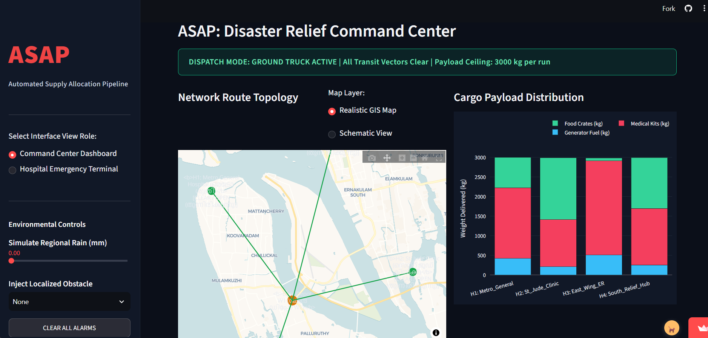
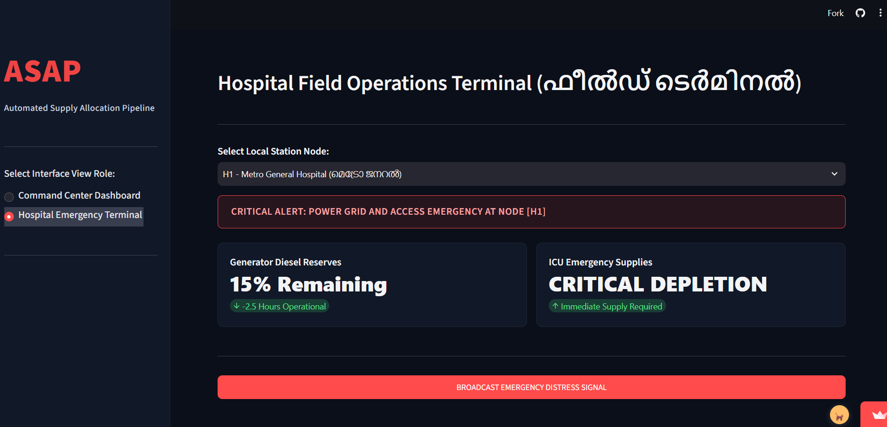
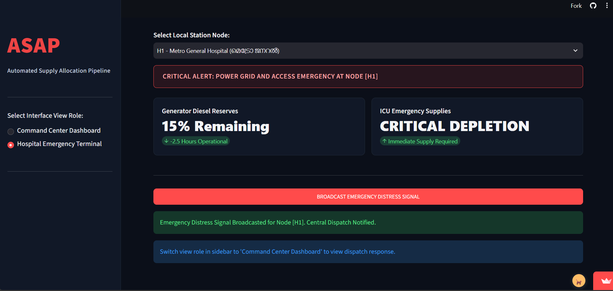
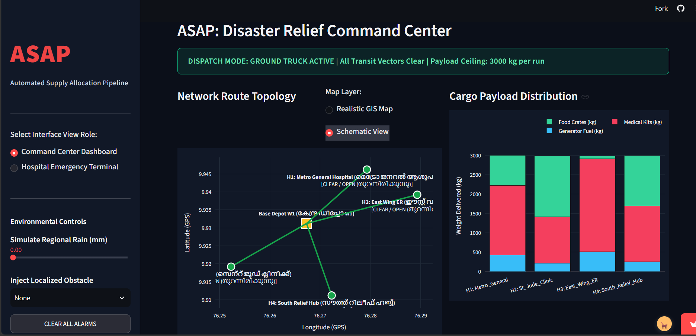
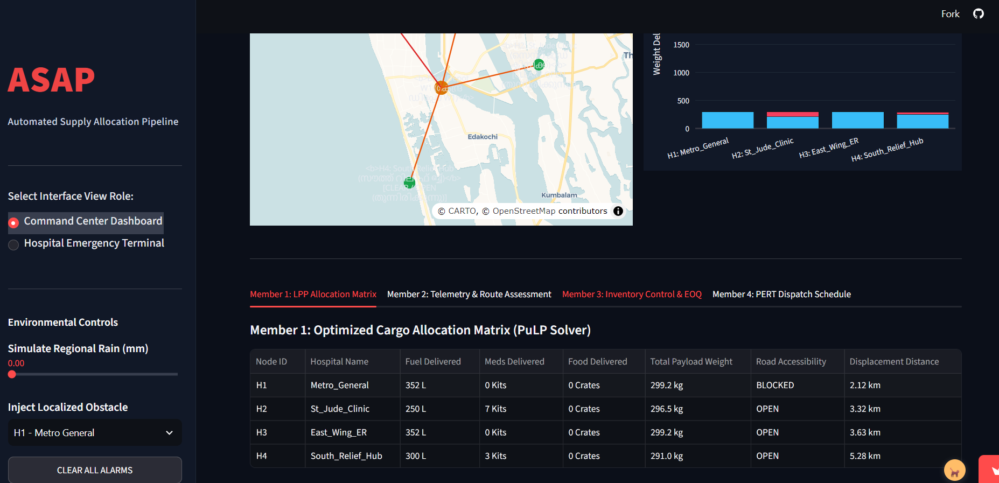
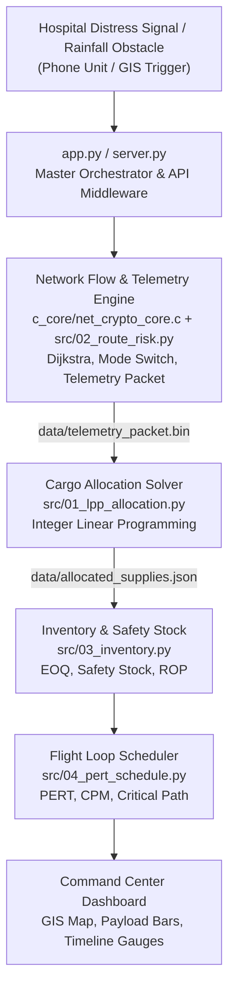
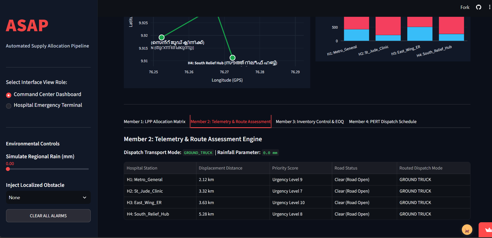
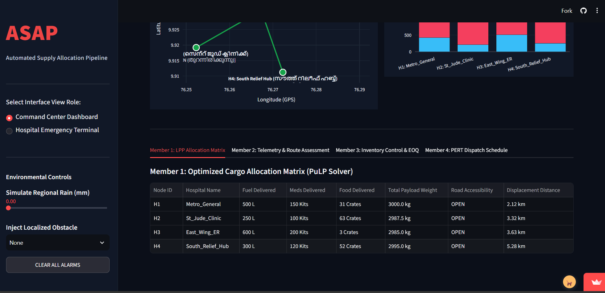
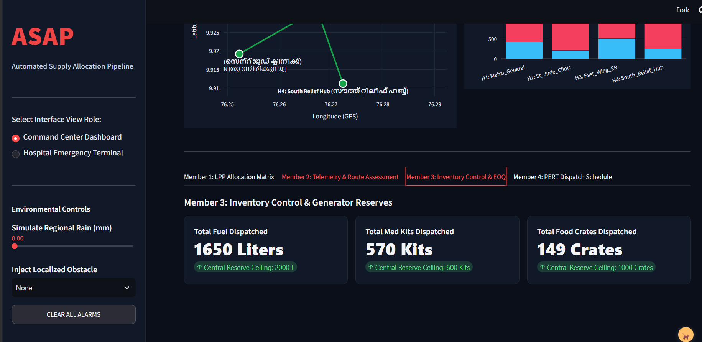
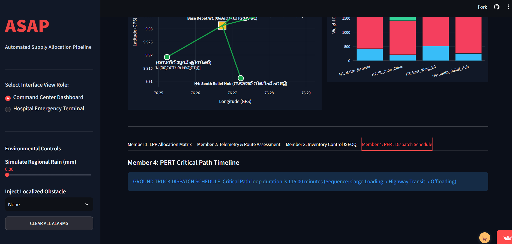

<div align="center">

# Project ASAP
### Automated Supply & Air-relief Platform

**From distress signal to a routed, optimized, scheduled drone relief mission in seconds.**

*An integrated Operations Research decision engine for hospitals cut off by flooding, built for Kerala.*

[](https://16701asap.streamlit.app/)


**[Try the Live Command Center](https://16701asap.streamlit.app/)** &nbsp;|&nbsp;
[GitHub](https://github.com/SRReumah/ASAP) &nbsp;|&nbsp;
[Quick Start](#quick-start) &nbsp;|&nbsp;
[Architecture](#system-architecture) &nbsp;|&nbsp;
[Methodology](#mathematical-methodology) &nbsp;|&nbsp;
[Team](#the-team)

<br/><br/>



<sub><i>The ASAP Command Center: live GIS routing from Base Depot W1 to four hospitals in Kochi, with optimized cargo per station.</i></sub>

</div>

---

## Table of Contents

1. [The Pitch in 30 Seconds](#the-pitch-in-30-seconds)
2. [The Problem](#the-problem)
3. [Why Kerala](#why-kerala)
4. [Our Solution](#our-solution)
5. [Who It Is For](#who-it-is-for)
6. [Key Features](#key-features)
7. [Demo Walkthrough](#demo-walkthrough)
8. [System Architecture](#system-architecture)
9. [Tech Stack](#tech-stack)
10. [Quick Start](#quick-start)
11. [Mathematical Methodology](#mathematical-methodology)
12. [Telemetry & Security](#telemetry--security)
13. [Repository Structure](#repository-structure)
14. [Engineering Decisions](#engineering-decisions)
15. [Known Limitations](#known-limitations)
16. [Roadmap](#roadmap)
17. [The Team](#the-team)
18. [Contributing](#contributing)
19. [Disclaimer and License](#disclaimer-and-license)

---

## The Pitch in 30 Seconds

> A flooded city. Roads underwater. A hospital ICU running on a diesel generator with hours of fuel left.
>
> Today, getting it help means phone calls, spreadsheets, and guesswork under pressure.
>
> **Project ASAP replaces that with one button.** A hospital sends a distress signal, and ASAP decides *how* to reach it, *what* to send, *when* to resupply, and *how long* it will take. It then encrypts the mission and shows everything on a live map.

| | Manual Coordination | Project ASAP |
|---|---|---|
| Route decision | Radio calls, local knowledge | Dijkstra shortest path with automatic air/ground switching |
| Cargo choice | Best guess | Integer Linear Programming, provably optimal for the scenario |
| Resupply timing | Reactive, after shortage | Reorder point computed per hospital, before stock runs out |
| Mission timing | Rough estimate | PERT/CPM with critical path and variance |
| Dispatch message | Free-text calls and messages | Compact 109-byte binary dispatch packet (encryption simulated; see below) |
| Time to decision | Minutes to hours | Seconds |

---

## The Problem

When severe flooding or natural disasters strike:

- **Roads submerge**, cutting hospitals off from ground logistics.
- **Power grids fail**, forcing ICUs and life support onto backup diesel generators that burn through fuel quickly.
- **Communications degrade**, and the messages that do get through can be spoofed or corrupted.
- **Coordinators decide under pressure**, often manually and with incomplete information, which leads to wrong cargo, late resupply, and wasted flights.

Every one of these is a well-studied problem in Operations Research. What is missing is a system that solves them **together and automatically**.

---

## Why Kerala

Project ASAP is built for Kerala, and was inspired by three floods that cut hospitals off in the same way:

| Event | What happened |
|---|---|
| **Rasuwa flash flood, Nepal (August 2026)** | 69 km of roads were damaged, Dhading and Trishuli Hospitals lost road connectivity to Kathmandu, and medicines and vaccines were flown in by helicopter and drone as an interim measure. ([Think Global Health](https://www.thinkglobalhealth.org/article/trauma-destruction-disruption-nepals-health-workers-struggle-in-aftermath-of-floods)) |
| **Kathmandu Valley floods, Nepal (September 2024)** | 240 to 322 mm of rain fell in 24 hours. The capital was cut off from transport and much of it lost power. ([Wikipedia summary](https://en.wikipedia.org/wiki/2024_Nepal_floods)) |
| **Kerala floods (August 2018)** | Lack of diesel for generators and of liquid oxygen were major constraints for hospitals, and private hospitals in Ernakulam ran short of oxygen. ([GDACS](https://www.gdacs.org/contentdata/maps/daily/FL/1000212_/content.xml)) |

Nepal's recent floods show the problem is growing; Kerala has already lived through it, and the monsoon returns every year. ASAP models a scaled-down Kochi scenario so that relief planners can have an optimized plan ready before the next flood.

---

## Our Solution

Project ASAP is an automated emergency-response "brain". A single distress broadcast triggers a four-stage decision pipeline:

| Question | Engine | Answer (Reference Scenario) |
|---|---|---|
| **How** do we get there safely? | Network Flow & Route Risk (C / Python) | Roads blocked, so switch to air drones; 12 km shortest road path to H1; 109-byte dispatch packet |
| **What** do we send? | Cargo Optimizer (Integer LPP) | Optimal mix of fuel, medical kits and food within strict weight caps (300 kg air / 3000 kg ground) |
| **When** do we resupply? | Inventory Control (EOQ) | Reorder point of 59 to 94 L per hospital, including a 35 L safety buffer |
| **How long** will it take? | Flight Scheduler (PERT/CPM) | 76.33 min expected air round trip, with the critical path identified |

Every result is computed live by backend engines, written to disk as physical artifacts (`.json`, `.bin`), and visualized in an interactive **GIS Command Center** with bilingual station labels (English and Malayalam).

---

## Who It Is For

| Persona | Pain Today | What ASAP Gives Them |
|---|---|---|
| **Disaster response coordinator** (district / state emergency ops) | Juggling many hospitals, routes and vehicles at once | One dashboard with ranked, optimized missions |
| **Hospital administrator** | No visibility into when help arrives or what is coming | A distress button plus a computed reorder point for generator fuel |
| **Drone / logistics operator** | Unclear payloads and unsafe routes | Weight-capped cargo plans and a timed flight schedule |
| **Students and researchers** | OR techniques taught in isolation | A working reference showing ILP, EOQ, PERT/CPM and Dijkstra chained together |

---

## Key Features

- **Intelligent Mode Switching and GIS Mapping**
  Detects flooded road segments using staggered rainfall thresholds and automatically reroutes from ground trucks to air relief drones on Carto-Voyager GIS maps.

- **Compact Dispatch Telemetry (prototype)**
  Packs each dispatch order into a 109-byte binary struct with a payload field and a 32-byte tag field. The current build uses a simulated cipher as a placeholder; real AES-256-CBC and HMAC-SHA256 are planned (see [Telemetry & Security](#telemetry--security)).

- **Multi-Scenario Cargo Optimization**
  Solves Integer Linear Programming cargo packing, verified against the CBC branch-and-bound solver, for three disaster profiles: **Power Grid Blackout**, **Mass Trauma Surge**, and **Balanced Relief**.

- **Predictive Fuel Reserves**
  Uses Economic Order Quantity and statistical safety-stock models to compute each hospital's reorder point, so resupply can be ordered *before* a generator runs dry.

- **Mission Timeline Forecasting**
  PERT/CPM engine computes expected task durations, variance, slack, and the critical path (A, D, E, F).

- **Triple-Layer Fault Tolerance**
  Runs on Streamlit Cloud, locally, or on a zero-dependency HTML/JS fallback server, so the dashboard stays available even if one layer fails.

---

## Demo Walkthrough

Follow along on the [live app](https://16701asap.streamlit.app/). The app has two views, switched from the sidebar: the **Hospital Emergency Terminal** (the hospital's side) and the **Command Center Dashboard** (the coordinator's side).

### Step 1: A hospital raises the alarm

Metro General Hospital (H1) is on 15% diesel with about 2.5 hours of generator time left, and its ICU supplies are critically low. The terminal shows the alert in English and Malayalam.



### Step 2: One button sends the distress signal

Pressing **Broadcast Emergency Distress Signal** notifies central dispatch instantly.



### Step 3: The Command Center plans the response

With roads clear, ASAP dispatches ground trucks at a 3000 kg payload ceiling. The schematic view plots every station on GPS coordinates with bilingual labels and live road status.



### Step 4: Disaster strikes the route

Inject an obstacle at H1 from the sidebar. The road to Metro General is marked **BLOCKED**, the system switches to air drones, and every payload is re-optimized to fit the 300 kg drone ceiling. With power as the priority, generator fuel now dominates each load.



| | Before (Ground, roads clear) | After (Air, H1 blocked) |
|---|---|---|
| Payload ceiling | 3000 kg per run | 300 kg per run |
| H1 cargo | 500 L fuel, 150 kits, 31 crates | 352 L fuel only |
| H1 road status | OPEN | BLOCKED |

### Step 5: Inspect each engine

The four tabs under the map show the output of each team member's engine. See them in [Mathematical Methodology](#mathematical-methodology) below.

---

## System Architecture

Four independent engines run in sequence under a central orchestrator. Each engine writes a physical artifact that the next stage and the dashboard consume.



### Pipeline Contract

| Stage | Input | Output Artifact | Consumed By |
|---|---|---|---|
| 1. Network Flow & Telemetry | `data/city_nodes.csv`, rainfall / flood state | `data/telemetry_packet.bin` (109 bytes) | Cargo solver, dashboard |
| 2. Cargo Allocation (ILP) | Transport mode, payload cap, scenario weights | `data/allocated_supplies.json` | Inventory engine, dashboard |
| 3. Inventory Control | Fuel burn rate, lead time, delivered fuel | Reorder status, safety stock | Scheduler, dashboard |
| 4. PERT/CPM Scheduler | Task time estimates (a, m, b) | Critical path, mission duration | Dashboard |

---

## Tech Stack

| Layer | Technology |
|---|---|
| Routing & Telemetry Core | C (GCC), Dijkstra's Algorithm, packed binary struct (simulated encryption) |
| Optimization & Analytics | Python 3.8+ (bounded integer ILP solver, EOQ, PERT/CPM) |
| GIS & Dashboards | Streamlit, Plotly (Carto-Voyager tiles), Pandas, Leaflet.js |
| Live Weather (optional) | Open-Meteo API |
| API Middleware | Python HTTP server (`server.py`, `app.py`) |
| Data Artifacts | CSV, JSON, packed binary (`.bin`) |
| Deployment | Streamlit Community Cloud, local, static HTML fallback |

---

## Quick Start

### Prerequisites

- Python 3.8 or newer
- GCC (optional; a pre-compiled Windows executable is included in `c_core/`)

### 1. Clone the repository

```bash
git clone https://github.com/SRReumah/ASAP.git
cd ASAP
```

### 2. Install dependencies

```bash
pip install -r requirements.txt
```

### 3. Launch the Command Center

```bash
streamlit run app.py
```

Open `http://localhost:8501` in your browser.

### Alternative Run Modes

<details>
<summary><b>Option B: Offline native server (no Streamlit needed)</b></summary>

```bash
python server.py
```

Opens `index.html` at `http://localhost:8000` automatically.
</details>

<details>
<summary><b>Option C: Run each engine on its own</b></summary>

```powershell
# Network Flow & Telemetry Engine (C, Windows binary)
.\c_core\net_crypto_core.exe 1 0

# Route Risk Assessment Engine
python src/02_route_risk.py

# Multi-Scenario Cargo Allocation Solver
python src/01_lpp_allocation.py

# Inventory & Safety Stock Control
python src/03_inventory.py

# PERT/CPM Flight Loop Scheduler
python src/04_pert_schedule.py
```
</details>

<details>
<summary><b>Building the C core on Linux or macOS</b></summary>

```bash
gcc c_core/net_crypto_core.c -o c_core/net_crypto_core
./c_core/net_crypto_core 1 0
```

If the core links against an external crypto library (for example OpenSSL), add the matching flag such as `-lcrypto`.
</details>

---

## Mathematical Methodology

<details open>
<summary><b>1. Network Routing (Dijkstra)</b></summary>

For each edge $(u, v)$ with weight $w(u,v)$, distance is relaxed when:

$$d(v) > d(u) + w(u, v) \;\Rightarrow\; d(v) \leftarrow d(u) + w(u, v)$$

Edges whose flood level exceeds their threshold are removed from the ground network. If no ground path remains, the system switches to air relief mode. Each station also carries an urgency score (H3 East Wing ER is highest at 10) that feeds the cargo optimizer.


</details>

<details open>
<summary><b>2. Cargo Optimization (Integer Linear Programming)</b></summary>

**Objective:** maximize priority-weighted relief value across stations $h \in H$ with urgency score $U_h$:

$$\max Z = \sum_{h \in H} U_h \left( w_{\text{fuel}} \, x_h^{\text{fuel}} + w_{\text{med}} \, x_h^{\text{med}} + w_{\text{food}} \, x_h^{\text{food}} \right)$$

**Subject to the payload ceiling:**

$$0.85\,x_h^{\text{fuel}} + 12.0\,x_h^{\text{med}} + 25.0\,x_h^{\text{food}} \le \text{CAP}_{\text{payload}} \quad (300\text{ kg Air} \;/\; 3000\text{ kg Ground})$$

$$x_h^{\text{fuel}},\; x_h^{\text{med}},\; x_h^{\text{food}} \in \mathbb{Z}_{\ge 0}$$

| Commodity | Unit | Unit Weight | Scenario Weight (Power / Medical / Balanced) |
|---|---|---|---|
| Generator Fuel | Litre | 0.85 kg | 5.0 / 1.0 / 3.0 |
| Medical Kit | Kit | 12.0 kg | 1.0 / 5.0 / 2.5 |
| Food Crate | Crate | 25.0 kg | 1.0 / 1.0 / 1.2 |

**Worked check (H1, ground mode):** 500 L fuel x 0.85 + 150 kits x 12.0 + 31 crates x 25.0 = 425 + 1800 + 775 = **3000.0 kg**, exactly at the ground ceiling.


</details>

<details open>
<summary><b>3. Inventory Control & Safety Stock</b></summary>

| Metric | Formula | Reference Value |
|---|---|---|
| Economic Order Quantity | $\text{EOQ} = \sqrt{\dfrac{2DS}{H}}$ | Dynamic |
| Safety Stock | $\text{SS} = Z \cdot \sigma_d \cdot \sqrt{L} = 1.65 \times 12.0 \times \sqrt{3}$ | $\approx 34.3 \rightarrow$ **35 L** |
| Reorder Point | $\text{ROP} = \bar{d} \cdot L + \text{SS}$ | **59 to 94 L** (per hospital) |

$Z = 1.65$ corresponds to roughly a 95% service level, with a 3-day lead time. Daily burn $\bar{d}$ is estimated from each hospital's delivered fuel, so the reorder point differs by hospital:

| Hospital | Daily burn (L/day) | EOQ (L) | Reorder point (L) |
|---|---|---|---|
| H1 Metro General | 16.4 | 1096 | 84 |
| H2 St Jude Clinic | 8.2 | 775 | 59 |
| H3 East Wing ER | 19.7 | 1200 | 94 |
| H4 South Relief Hub | 9.9 | 849 | 64 |

*Ground-mode Balanced Relief run.*

The dashboard tracks total dispatch against central reserve ceilings. In the reference run, 1650 L of fuel (of 2000 L), 570 medical kits (of 600) and 149 food crates (of 1000) are dispatched across all four hospitals.


</details>

<details open>
<summary><b>4. PERT/CPM Flight Scheduling</b></summary>

| Metric | Formula | Meaning |
|---|---|---|
| Expected Task Time | $T_e = \dfrac{a + 4m + b}{6}$ | Weighted average of optimistic, most likely and pessimistic times |
| Task Variance | $\sigma^2 = \left(\dfrac{b - a}{6}\right)^2$ | Uncertainty spread |
| Slack | $\text{Slack} = \text{LS} - \text{ES}$ | Zero slack means the task is on the critical path |

The zero-slack sequence **A, D, E, F** forms the critical path, giving a non-delayable mission round trip of **76.33 minutes**.

| Mode | Critical Path Sequence | Loop Duration |
|---|---|---|
| Air drone | Cargo Loading, Flight Transit, Winch Offload, Fuel Ingest | **76.33 min** |
| Ground truck | Cargo Loading, Highway Transit, Offloading | **115.00 min** (fixed estimate shown on the dashboard, not yet computed by the PERT engine) |


</details>

---

## Telemetry & Security

Each dispatch order is packed into a 109-byte binary struct (`data/telemetry_packet.bin`):

| Field | Size | Contents |
|---|---|---|
| Magic byte | 1 B | Protocol identifier (0xAA) |
| Sender ID | 2 B | Central base (101) |
| Target node | 1 B | Hospital index (1 to 4) |
| Dispatch mode | 1 B | 0 = ground, 1 = air |
| Sequence number | 4 B | Message counter |
| Timestamp | 4 B | Epoch time |
| Payload | 64 B | Route message (dispatch target, mode and distance) |
| Tag | 32 B | Integrity tag field |

**Current status (honest scope):** to run on Windows without external crypto libraries, the current C build uses a **simple XOR cipher as a placeholder** for the payload and fills the tag field with a **deterministic simulated value**. This demonstrates the packet design, not real security.

**Planned:** replace the placeholders with AES-256-CBC encryption and an HMAC-SHA256 tag from a vetted library (such as OpenSSL), with a random IV per packet, encrypt-then-MAC verification, key management and replay protection.

---

## Repository Structure

```text
ASAP/
├── app.py                      # Master Streamlit GIS Command Center
├── server.py                   # Python HTTP API server & middleware
├── index.html                  # Dual-view web command center (phone / laptop UI)
├── requirements.txt            # Python dependencies
├── images/                     # README screenshots (image1.png to image9.png)
├── c_core/
│   ├── net_crypto_core.c       # Dijkstra routing & telemetry packet builder
│   └── net_crypto_core.exe     # Pre-compiled Windows binary
├── data/
│   ├── city_nodes.csv          # Station nodes: demand, urgency, road status, coordinates
│   ├── allocated_supplies.json # Output of the ILP cargo solver
│   └── telemetry_packet.bin    # 109-byte dispatch packet from the C core
└── src/
    ├── 01_lpp_allocation.py    # Multi-scenario ILP cargo allocation
    ├── 02_route_risk.py        # GIS route risk & telemetry assessment
    ├── 03_inventory.py         # Inventory control & EOQ
    └── 04_pert_schedule.py     # PERT/CPM flight loop scheduler
```

---

## Engineering Decisions

| Decision | Why |
|---|---|
| **C for routing and telemetry** | Low-level control over the packed binary struct; mirrors how embedded drone firmware would handle telemetry. |
| **Python for optimization** | Clear, readable OR models that are easy to verify against textbook formulas. |
| **File artifacts between stages** | Each engine can be run, tested and debugged on its own; outputs are inspectable evidence. |
| **Three run modes** | A disaster tool must not depend on a single server; the HTML fallback works with no installs. |
| **Bilingual labels** | Local responders read station names in their own language (Malayalam alongside English). |

---

## Known Limitations

We would rather be clear about these than overclaim:

- **Simulated data.** Demands, urgency scores, flood thresholds and costs are synthetic. The engine CSV still holds Kathmandu coordinates from the first prototype, while the dashboard map shows Kochi; switching to Kochi coordinates changes air distances but not the transport mode or the ILP results.
- **Single-vehicle model.** The ILP plans one payload per mission; fleet-level routing (VRP) is not yet modelled.
- **Static weights.** Scenario weights are hand-set. In air mode, the Mass Trauma Surge weights still favour fuel, because fuel carries more value per kilogram; kits only take over when their weight exceeds about 14 times fuel's.
- **No aviation compliance.** Drone flight rules, airspace permissions and weather limits are out of scope.
- **Placeholder encryption.** The C core uses a simulated cipher and tag. See [Telemetry & Security](#telemetry--security).
- **Fixed ground schedule.** The 115-minute ground loop is a fixed estimate, not computed by the PERT engine.
- **Windows-first binary.** The bundled C executable targets Windows; other platforms must compile from source.

---

## Roadmap

| Phase | Goal | Highlights |
|---|---|---|
| **v1.0 (current)** | Academic prototype | Four engines, live dashboard, encrypted telemetry |
| **v1.5** | Fleet scale | Multi-drone Vehicle Routing Problem, multiple hospitals per mission |
| **v2.0** | Real data | Live rainfall / flood feeds, real road networks via OpenStreetMap |
| **v2.5** | Field readiness | Key management, replay protection, offline mobile app for hospitals |
| **v3.0** | Pilot | Partnership with a disaster management authority or NGO for a tabletop exercise |

---

## The Team

Project ASAP was built by a team of four, each owning one engine end to end.

| Member | Module | Ownership |
|---|---|---|
| **[Member 1 Name]** ([@github-handle](https://github.com/)) | Module 1: LPP Cargo Allocation | Linear programming, multi-commodity payload optimization, scenario weights |
| **[Member 2 Name]** ([@github-handle](https://github.com/)) | Module 2: Network Flow & Telemetry | Dijkstra shortest path, flood risk thresholds, telemetry packet design |
| **[Member 3 Name]** ([@github-handle](https://github.com/)) | Module 3: Inventory Control | Fuel burn modelling, EOQ, safety reserve alarms |
| **[Member 4 Name]** ([@github-handle](https://github.com/)) | Module 4: PERT/CPM Flight Scheduler | Task variance, forward/backward passes, critical path analysis |

**Shared work:** system integration, the Streamlit Command Center, the HTML fallback server, and deployment.

---

## Contributing

Ideas, issues and pull requests are welcome.

1. Fork the repository.
2. Create a branch: `git checkout -b feature/your-idea`
3. Commit your changes with a clear message.
4. Open a pull request describing what changed and why.

Good first contributions: real-world datasets, unit tests for each engine, and a Linux/macOS build script.

---

## Disclaimer and License

Project ASAP is an **academic prototype** that demonstrates how Operations Research and GIS modelling can work together for flood relief. It uses simulated disaster data, its encryption is a placeholder, and it has not been evaluated for civil aviation compliance. Do not use it for real emergency operations.

Distributed under the **MIT License**. See `LICENSE` for details.

<div align="center">

**Built to deliver relief where it is needed most, ASAP.**

[Try the Live Demo](https://16701asap.streamlit.app/) &nbsp;|&nbsp; Star the repo if you found it useful

</div>